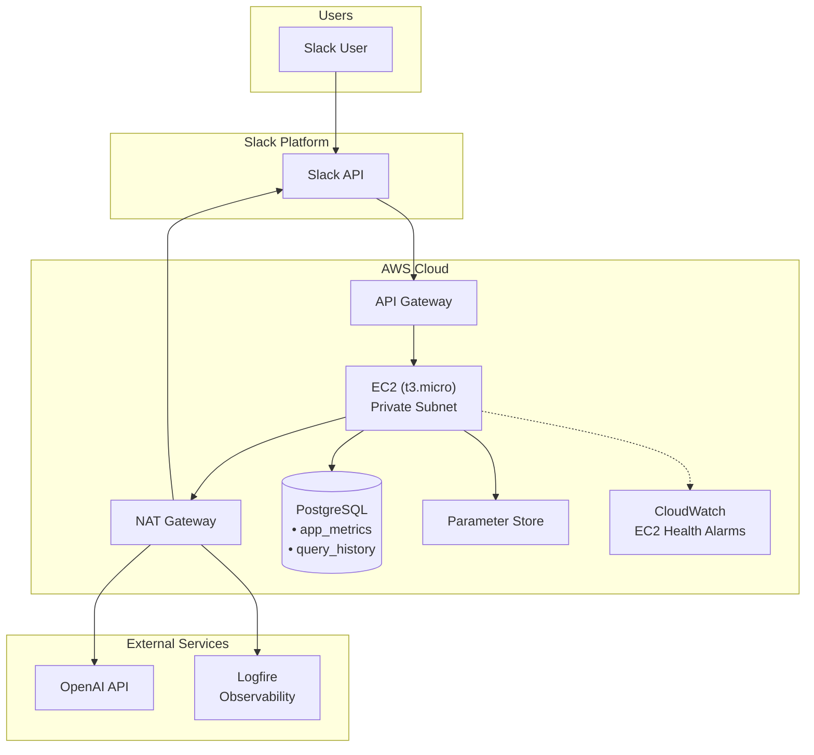
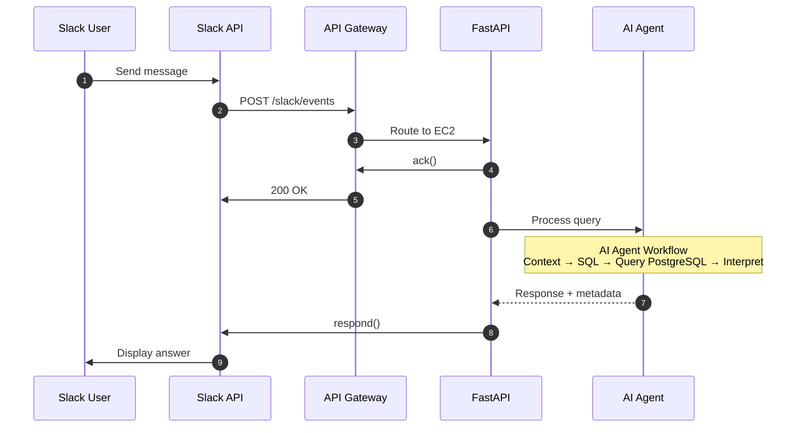
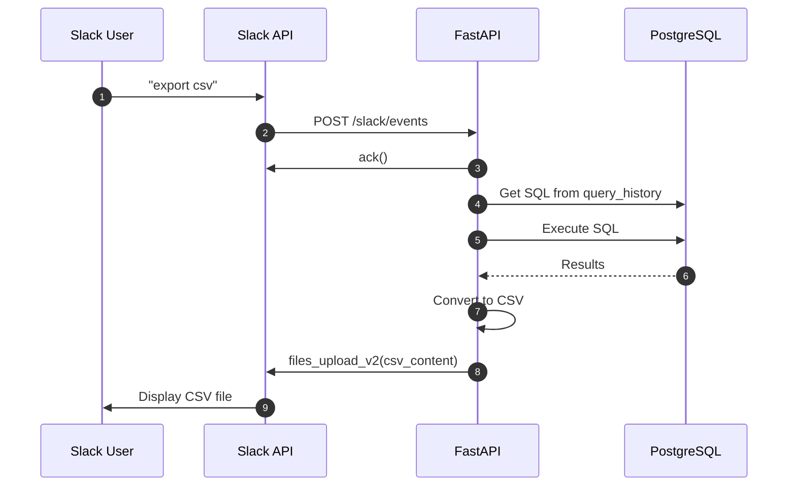
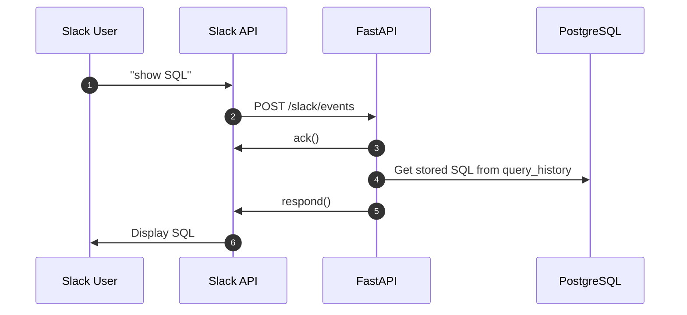
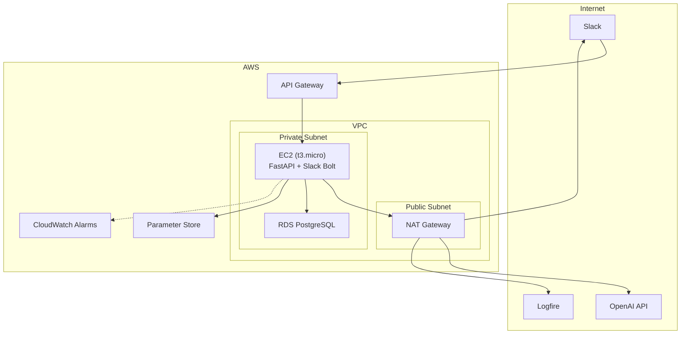

# Slack Analytics Chatbot
## System Architecture Document
### Production-Ready Architecture (~$56/month)

---

## 1. System Architecture

### 1.1 Architecture Diagram

### 1.2 Component Summary

| Layer | Component | Technology | Purpose |
|-------|-----------|------------|---------|
| Platform | Slack API | Slack Events API | Message handling |
| Network | API Gateway | AWS HTTP API | HTTPS endpoint |
| Network | NAT Gateway | AWS NAT | Outbound internet for private subnet |
| Compute | Application | EC2 (t3.micro) | Application server |
| Data | Database | RDS PostgreSQL | App metrics + query history |
| Security | Secrets | Parameter Store | Credentials (encrypted) |
| Observability | App Monitoring | Logfire | Logs, traces, LLM tracking |
| Observability | Infra Alerts | CloudWatch | EC2 health alarms only |
| External | LLM | OpenAI API | Text-to-SQL, interpretation |

### 1.3 Data Storage

| Data | Storage |
|------|---------|
| App Metrics | PostgreSQL |
| Query History | PostgreSQL |
| CSV Export | Direct to Slack (in-memory) |
| Traces & Logs | Logfire |

---

## 2. Sequence Diagrams

### 2.1 Analytics Query Flow

### 2.2 CSV Export Flow

### 2.3 SQL Retrieval Flow

---

## 3. Deployment Architecture

### 3.1 Infrastructure Diagram

### 3.2 Network Configuration

| Subnet | CIDR | Purpose | Internet |
|--------|------|---------|----------|
| Public | 10.0.1.0/24 | NAT Gateway | Yes (IGW) |
| Private | 10.0.100.0/24 | EC2 + RDS | Via NAT |

### 3.3 Security Groups

| Security Group | Inbound | Outbound | Attached To |
|----------------|---------|----------|-------------|
| `sg-ec2` | 8000 from API GW, 22 (SSH via bastion) | All | EC2 |
| `sg-rds` | 5432 from sg-ec2 | None | RDS |

---

## 4. Technology Stack

### 4.1 Application

| Category | Technology | Purpose |
|----------|------------|---------|
| Runtime | Python 3.12 | Application |
| Framework | FastAPI | HTTP server |
| Slack | slack-bolt[async] | Slack integration |
| Database | SQLAlchemy + asyncpg | PostgreSQL access |
| LLM | openai | OpenAI API client |
| Observability | logfire | Tracing & logging |
| AWS | boto3 | Parameter Store |

### 4.2 AWS Services

| Service | Configuration | Monthly Cost |
|---------|--------------|--------------|
| API Gateway | HTTP API | ~$0.10 |
| EC2 | t3.micro | ~$8 |
| RDS PostgreSQL | db.t3.micro | ~$15 |
| NAT Gateway | Single AZ | ~$32 |
| Parameter Store | SecureString | Free |
| CloudWatch | 2 alarms | ~$0.20 |
| **Total** | | **~$56/month** |

### 4.3 External Services

| Service | Purpose | Cost |
|---------|---------|------|
| OpenAI API | LLM | Pay-per-use |
| Logfire | Observability | Free (10M events) |

---

## 5. Observability

### 5.1 Logfire (Application)

| Captures |
|----------|
| HTTP requests |
| LLM calls (tokens, latency, cost) |
| DB queries |
| Errors & stack traces |
| Custom traces |

### 5.2 CloudWatch (Infrastructure)

| Alert | Condition | Action |
|-------|-----------|--------|
| EC2 Down | StatusCheckFailed | SNS → Email/Slack |
| High CPU | CPU > 80% for 10 min | SNS → Email/Slack |

---

## 6. Database Schema

### PostgreSQL

| Table | Purpose | Retention |
|-------|---------|-----------|
| `app_metrics` | Analytics data | Permanent |
| `query_history` | Conversation context, cached results | 1 year |

---

## 7. Scaling

| Parameter | Value |
|-----------|-------|
| Instance | t3.micro (upgradeable) |
| Capacity | 60-120 req/min |
| Scaling | Vertical (resize) or add instances |

---

## 8. Environment Variables

| Variable | SSM Path | Description |
|----------|----------|-------------|
| **Project** |||
| `PROJECT_NAME` | `/analytics-bot/project-name` | App name |
| `DEBUG` | `/analytics-bot/debug` | Debug mode |
| `ENVIRONMENT` | `/analytics-bot/environment` | local/dev/prod |
| **Logfire** |||
| `LOGFIRE_TOKEN` | `/analytics-bot/logfire-token` | Write token |
| `LOGFIRE_READ_TOKEN` | `/analytics-bot/logfire-read-token` | Read token |
| `LOGFIRE_SERVICE_NAME` | `/analytics-bot/logfire-service` | Service name |
| `LOGFIRE_ENVIRONMENT` | `/analytics-bot/logfire-env` | Environment |
| **PostgreSQL** |||
| `POSTGRES_HOST` | `/analytics-bot/postgres-host` | DB host |
| `POSTGRES_PORT` | `/analytics-bot/postgres-port` | DB port |
| `POSTGRES_USER` | `/analytics-bot/postgres-user` | DB user |
| `POSTGRES_PASSWORD` | `/analytics-bot/postgres-password` | DB password |
| `POSTGRES_DB` | `/analytics-bot/postgres-db` | DB name |
| **OpenAI** |||
| `OPENAI_API_KEY` | `/analytics-bot/openai-key` | API key |
| `AI_MODEL` | `/analytics-bot/ai-model` | Model name (gpt-4.1) |
| **Slack** |||
| `SLACK_BOT_TOKEN` | `/analytics-bot/slack-token` | Bot token |
| `SLACK_SIGNING_SECRET` | `/analytics-bot/slack-secret` | Signing secret |

---

## 9. Architecture Decisions

| Decision | Choice | Rationale |
|----------|--------|-----------|
| Load Balancer | API Gateway | Pay-per-request |
| NAT Gateway | Yes | Production security, no public IP on compute |
| Compute | EC2 (t3.micro) | Cheap, SSH access |
| Secrets | Parameter Store | Free, encrypted |
| Data Storage | PostgreSQL | Single DB for all data |
| CSV Export | Direct to Slack | No S3 needed |
| App Observability | Logfire | Traces, logs, LLM tracking |
| Infra Alerts | CloudWatch | EC2 health only (2 alarms) |

---

## 10. Cost Summary

| | Monthly Cost |
|--|--------------|
| Initial design | $97 |
| **Final (Production)** | **$56** |
| **Savings** | **$41 (42%)** |
