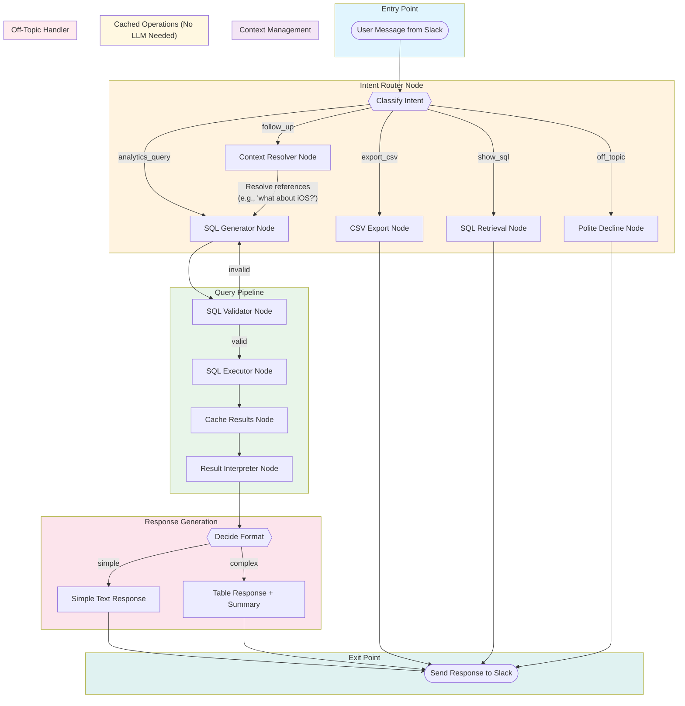

# LangGraph Workflow Design: Slack Analytics Chatbot

## Overview

This document describes the complete LangGraph workflow architecture for an internal Slack chatbot that provides data analytics and business intelligence for the Rounds apps portfolio. The chatbot converts natural language questions into SQL queries, executes them, and returns intelligently formatted responses.

---

## Architecture Diagram



[🎨 Open in Mermaid Live Editor](https://mermaid.ai/live/edit?utm_source=mermaid_mcp_server&utm_medium=remote_server&utm_campaign=claude#pako:eNqFVW1vmzAQ_isn9mGttnavlbZp6sQI3ZAIZMCiVqWKCJwbNIKpcbpETf_7bDBJnBAtX5Kcn-fufM_d-clIaYbGFyMuSUH_prOEcYgGcQniUy-m9yypZmCXnK1uY6P5hhHNSx4bdy1IfsLIDKKT2981MhhiXSf3CITROYRFkv65O22RWGZxuec5oAuOTLh2So4lV__BE0lpESzXDEPn6ubpKTasIqnrnKyg5cTG8_MhEM7OLtdJmRQrnqf15GGBbLUG0zPdm8ixwiMEQgtRhcmiWoPle5F9HU0CO_TdsR0cYeCyooxP0vpRUMLxxL4e-UF0BFzPhPP6oVhD-MsVnqPAscemewRNCZlwWuXpGga25TqefbyOFhW1WPKhuPE9zkVVREmVDbZGvaR7F9xhBFjT4rFXhz2STBTWsaEYwJAgwzLF-uuUvbk8wfP789fw8u8s4ZBMhbiQ--G3l6excSBG37V-SdlGeYVFXqJIsPkPnUHLbONNwER14QeWyBJOey6xgTbZCwGcgRn5gSKOkyLP-okbaKPPowSuwb62rd_CdgyWlwrY03wdV4W2l5gueiN3wCZjy7R-2lKuJJ2hFGtR8LpHKwlrCI4QLRiJfuvauHcUsa5oWaMqXE7L20bXxghbqxZjx3OLFqk0c8kqhr2TvMNocrvyg6EZTUSHO6Hje3LAB5jmGcIVZfNkb7z30O1U5fOqQDFTznDk2rI1R74XygKFzQlEqqebm2jJ9LlLqSQt1xCZ33V3UTItcOMIXkG4mM8Tttq47J1MKVLmV6p6dadbBlsbnHgUXHcIHmKG2aku42arSGo4Fl0iV85hZbWdojoqQM5yFA2ow_sS9QmJ5LYRTPHzrPkNP5MyK5BpcdQyErgRLXKOIPSS4_j_EPYyl4tJfvW8IrY3OLkNBW9bYk6PPiHNm9OOg1qayq53QYMQnttDXVL9bFtn3a6VVT9Sldga1X35SvRJ-1iSvCi-vMB35ILg7ql66NpjQsgHfLt7fLDPO-QHvCAXu0htRXbhPpEL_KyFOxjuzmGKHzHVQu817DbHT_huF9g1zAaAU9Tu2OisMnpL3hPBNp7_AXeBnMk)

---

## Database Schema

The chatbot works with a simple analytics database containing mobile app metrics:

```sql
CREATE TABLE app_metrics (
    id SERIAL PRIMARY KEY,
    app_name VARCHAR(255) NOT NULL,        -- e.g., "Paint for Android", "Countdown iOS"
    platform VARCHAR(50) NOT NULL,          -- "iOS" or "Android"
    date DATE NOT NULL,                     -- The reporting date
    country VARCHAR(100) NOT NULL,          -- Geographic country
    installs INTEGER DEFAULT 0,             -- Number of downloads
    in_app_revenue DECIMAL(12,2) DEFAULT 0, -- Revenue from in-app purchases
    ads_revenue DECIMAL(12,2) DEFAULT 0,    -- Revenue from advertisements
    ua_cost DECIMAL(12,2) DEFAULT 0,        -- User Acquisition Cost
    
    -- Indexes for common queries
    INDEX idx_platform (platform),
    INDEX idx_date (date),
    INDEX idx_country (country),
    INDEX idx_app_name (app_name)
);

-- Computed column for total revenue (can be a view)
CREATE VIEW app_metrics_extended AS
SELECT 
    *,
    (in_app_revenue + ads_revenue) AS total_revenue,
    (in_app_revenue + ads_revenue - ua_cost) AS net_revenue
FROM app_metrics;
```

---

## Graph State Schema

The state object that flows through all nodes in the LangGraph workflow:

```python
from typing import TypedDict, Optional, Literal, Any
from datetime import datetime
from langgraph.graph import MessagesState

class CacheEntry(TypedDict):
    """Structure for cached query results."""
    sql: str
    results: list[dict[str, Any]]
    timestamp: datetime
    natural_query: str
    assumptions: list[str]

class ChatbotState(MessagesState):
    """
    Complete state schema for the Slack Analytics Chatbot.
    Extends MessagesState to include conversation history management.
    """
    
    # ===== Core Conversation =====
    user_query: str                          # Current user message
    user_id: str                             # Slack user ID (for future permissions)
    channel_id: str                          # Slack channel ID
    thread_ts: Optional[str]                 # Thread timestamp for replies
    conversation_history: list[dict]         # Previous Q&A pairs in session
    
    # ===== Intent Classification =====
    intent: Literal[
        "analytics_query",  # New data question
        "follow_up",        # References previous context
        "export_csv",       # Request to download data
        "show_sql",         # Request to see SQL query
        "off_topic"         # Not related to app analytics
    ]
    confidence: float                        # Intent classification confidence
    
    # ===== Context Resolution =====
    resolved_query: Optional[str]            # Expanded query after context resolution
    referenced_query_id: Optional[str]       # ID of query being referenced
    
    # ===== SQL Pipeline =====
    generated_sql: Optional[str]             # The SQL query generated
    sql_valid: bool                          # Validation result
    sql_error: Optional[str]                 # Error message if invalid
    retry_count: int                         # Number of SQL generation retries
    query_results: Optional[list[dict]]      # Raw query results
    row_count: int                           # Number of rows returned
    column_names: list[str]                  # Column headers
    
    # ===== Caching (Cost Optimization) =====
    query_cache: dict[str, CacheEntry]       # Maps query_id -> cached data
    current_query_id: Optional[str]          # ID of current/most recent query
    
    # ===== Response Generation =====
    response_format: Literal["simple", "table", "error"]
    response_text: str                       # Final formatted response
    assumptions_made: list[str]              # Assumptions noted for user
    slack_blocks: Optional[list[dict]]       # Slack Block Kit formatted response
    
    # ===== Observability =====
    # Note: Logfire handles trace IDs automatically via OpenTelemetry
    node_timings: dict[str, float]           # Performance metrics per node (optional)
```

---

## Node Implementations

### 1. Intent Router Node

**Purpose:** Classifies user intent to route to the appropriate pipeline.

**LLM Required:** Yes (for ambiguous cases), No (for explicit keywords)

```python
from langchain_core.prompts import ChatPromptTemplate
from langchain_openai import ChatOpenAI
import logfire

INTENT_CLASSIFIER_PROMPT = ChatPromptTemplate.from_messages([
    ("system", """You are an intent classifier for a mobile app analytics chatbot.
    
Classify the user's message into ONE of these categories:
- analytics_query: A new question about app data (installs, revenue, costs, etc.)
- follow_up: A question that references previous context (e.g., "what about iOS?", "and last month?")
- export_csv: Request to download/export data as CSV
- show_sql: Request to see the SQL query used
- off_topic: Not related to app analytics

Respond with JSON: {{"intent": "<category>", "confidence": <0.0-1.0>}}

App analytics topics include: installs, downloads, revenue, ads, in-app purchases, 
UA cost, user acquisition, countries, platforms (iOS/Android), app names, dates, 
comparisons, rankings, trends."""),
    ("human", """Conversation history:
{history}

Current message: {query}

Classify this message:""")
])

llm = ChatOpenAI(model="gpt-4o-mini", temperature=0)

def classify_intent(state: ChatbotState) -> dict:
    """
    Route to appropriate pipeline based on user intent.
    Uses keyword matching first, then LLM for ambiguous cases.
    """
    with logfire.span('classify_intent', user_query=state["user_query"]):
        query_lower = state["user_query"].lower().strip()
        
        # ===== Fast-path: Keyword detection (no LLM needed) =====
        
        # CSV export requests
        csv_keywords = ["export", "csv", "download", "save as", "get file"]
        if any(kw in query_lower for kw in csv_keywords):
            logfire.info('Intent detected via keyword', intent='export_csv')
            return {"intent": "export_csv", "confidence": 0.95}
        
        # SQL display requests
        sql_keywords = ["show sql", "show me the sql", "what sql", "sql query", 
                        "sql statement", "what query", "see the query"]
        if any(kw in query_lower for kw in sql_keywords):
            logfire.info('Intent detected via keyword', intent='show_sql')
            return {"intent": "show_sql", "confidence": 0.95}
        
        # ===== LLM classification for ambiguous cases =====
        
        # Format conversation history
        history_text = "\n".join([
            f"User: {turn['user']}\nBot: {turn['bot'][:200]}..."
            for turn in state.get("conversation_history", [])[-5:]  # Last 5 turns
        ]) or "No previous conversation."
        
        with logfire.span('llm_intent_classification'):
            chain = INTENT_CLASSIFIER_PROMPT | llm
            response = chain.invoke({
                "query": state["user_query"],
                "history": history_text
            })
        
        # Parse response
        import json
        try:
            result = json.loads(response.content)
            logfire.info('Intent classified', intent=result["intent"], confidence=result.get("confidence", 0.8))
            return {
                "intent": result["intent"],
                "confidence": result.get("confidence", 0.8)
            }
        except json.JSONDecodeError:
            logfire.warn('Failed to parse intent response, defaulting to analytics_query')
            return {"intent": "analytics_query", "confidence": 0.5}
```

---

### 2. Context Resolver Node

**Purpose:** Expands follow-up questions using conversation history to create standalone queries.

**LLM Required:** Yes

```python
CONTEXT_RESOLVER_PROMPT = ChatPromptTemplate.from_messages([
    ("system", """You resolve ambiguous follow-up questions by incorporating context from conversation history.

Your task: Rewrite the current question as a complete, standalone question that includes all necessary context.

Examples:
- History: "How many Android apps do we have?" → "We have 15 Android apps"
- Current: "what about iOS?"
- Resolved: "How many iOS apps do we have?"

- History: "Which country generates the most revenue?" → "USA with $1.2M"
- Current: "and the least?"
- Resolved: "Which country generates the least revenue?"

- History: "Show me installs for Paint app in January"
- Current: "compare to February"
- Resolved: "Compare installs for Paint app between January and February"

Return ONLY the resolved question, nothing else."""),
    ("human", """Conversation history:
{history}

Current question: {current_query}

Resolved question:""")
])

def resolve_context(state: ChatbotState) -> dict:
    """
    Expand follow-up questions using conversation context.
    Identifies which previous query is being referenced.
    """
    with logfire.span('resolve_context', current_query=state["user_query"]):
        # Format history with query IDs for reference
        history_text = "\n".join([
            f"[Query {i+1}] User: {turn['user']}\nBot: {turn['bot'][:300]}"
            for i, turn in enumerate(state.get("conversation_history", [])[-5:])
        ])
        
        if not history_text:
            logfire.info('No history to resolve against')
            return {
                "resolved_query": state["user_query"],
                "referenced_query_id": None
            }
        
        with logfire.span('llm_context_resolution'):
            chain = CONTEXT_RESOLVER_PROMPT | llm
            response = chain.invoke({
                "current_query": state["user_query"],
                "history": history_text
            })
        
        resolved = response.content.strip()
        referenced_id = state.get("current_query_id")
        
        logfire.info('Context resolved', 
                     original=state["user_query"], 
                     resolved=resolved)
        
        return {
            "resolved_query": resolved,
            "referenced_query_id": referenced_id
        }
```

---

### 3. SQL Generator Node

**Purpose:** Converts natural language questions into SQL queries.

**LLM Required:** Yes

```python
DB_SCHEMA = """
TABLE: app_metrics
COLUMNS:
- app_name (VARCHAR): Name of the mobile app (e.g., "Paint for Android", "Countdown iOS")
- platform (VARCHAR): Operating system - "iOS" or "Android"
- date (DATE): The reporting date
- country (VARCHAR): Geographic country where metrics were recorded
- installs (INTEGER): Number of app downloads
- in_app_revenue (DECIMAL): Revenue from in-app purchases
- ads_revenue (DECIMAL): Revenue from advertisements
- ua_cost (DECIMAL): User Acquisition Cost (marketing spend)

COMPUTED:
- total_revenue = in_app_revenue + ads_revenue
- net_revenue = total_revenue - ua_cost

NOTES:
- Data is daily granular
- Use SUM() for aggregating revenue/installs across dates
- "Popularity" typically means installs unless specified otherwise
- Revenue comparisons should consider total_revenue unless user specifies
"""

FEW_SHOT_EXAMPLES = """
Q: How many apps do we have?
SQL: SELECT COUNT(DISTINCT app_name) as app_count FROM app_metrics;
Assumptions: Counting unique app names across all platforms.

Q: How many Android apps do we have?
SQL: SELECT COUNT(DISTINCT app_name) as android_app_count FROM app_metrics WHERE platform = 'Android';
Assumptions: None.

Q: Which country generates the most revenue?
SQL: SELECT country, SUM(in_app_revenue + ads_revenue) as total_revenue 
     FROM app_metrics 
     GROUP BY country 
     ORDER BY total_revenue DESC 
     LIMIT 10;
Assumptions: Using all available data (no date filter specified). Revenue = in_app + ads.

Q: List all iOS apps sorted by popularity
SQL: SELECT app_name, SUM(installs) as total_installs 
     FROM app_metrics 
     WHERE platform = 'iOS' 
     GROUP BY app_name 
     ORDER BY total_installs DESC;
Assumptions: Popularity defined as total installs.

Q: Which apps had the biggest change in UA spend comparing Jan 2025 to Dec 2024?
SQL: WITH jan_2025 AS (
       SELECT app_name, SUM(ua_cost) as ua_jan
       FROM app_metrics 
       WHERE date BETWEEN '2025-01-01' AND '2025-01-31'
       GROUP BY app_name
     ),
     dec_2024 AS (
       SELECT app_name, SUM(ua_cost) as ua_dec
       FROM app_metrics 
       WHERE date BETWEEN '2024-12-01' AND '2024-12-31'
       GROUP BY app_name
     )
     SELECT 
       COALESCE(j.app_name, d.app_name) as app_name,
       COALESCE(ua_jan, 0) as jan_2025_ua,
       COALESCE(ua_dec, 0) as dec_2024_ua,
       COALESCE(ua_jan, 0) - COALESCE(ua_dec, 0) as ua_change,
       CASE WHEN ua_dec > 0 THEN 
         ROUND(((ua_jan - ua_dec) / ua_dec) * 100, 2)
       ELSE NULL END as change_percent
     FROM jan_2025 j
     FULL OUTER JOIN dec_2024 d ON j.app_name = d.app_name
     ORDER BY ABS(COALESCE(ua_jan, 0) - COALESCE(ua_dec, 0)) DESC;
Assumptions: Comparing full months. Showing absolute change.
"""

SQL_GENERATOR_PROMPT = ChatPromptTemplate.from_messages([
    ("system", """You are an expert SQL generator for a mobile app analytics database.

DATABASE SCHEMA:
{schema}

EXAMPLES:
{examples}

RULES:
1. Generate ONLY SELECT statements (no INSERT, UPDATE, DELETE, DROP)
2. Always use appropriate aggregations (SUM, COUNT, AVG) for metrics
3. Include meaningful column aliases
4. Add LIMIT for potentially large result sets
5. Note any assumptions made about ambiguous terms

Return JSON format:
{{
    "sql": "<your SQL query>",
    "assumptions": ["assumption 1", "assumption 2"]
}}"""),
    ("human", "Question: {query}")
])

def generate_sql(state: ChatbotState) -> dict:
    """
    Generate SQL from natural language query.
    Uses the resolved query if available (for follow-ups).
    """
    query = state.get("resolved_query") or state["user_query"]
    
    with logfire.span('generate_sql', query=query, retry_count=state.get("retry_count", 0)):
        
        with logfire.span('llm_sql_generation'):
            chain = SQL_GENERATOR_PROMPT | llm
            response = chain.invoke({
                "schema": DB_SCHEMA,
                "examples": FEW_SHOT_EXAMPLES,
                "query": query
            })
        
        import json
        try:
            result = json.loads(response.content)
            logfire.info('SQL generated successfully',
                        sql_length=len(result["sql"]),
                        assumptions_count=len(result.get("assumptions", [])))
            return {
                "generated_sql": result["sql"],
                "assumptions_made": result.get("assumptions", []),
                "retry_count": state.get("retry_count", 0)
            }
        except json.JSONDecodeError:
            # Try to extract SQL from response
            content = response.content
            if "SELECT" in content.upper():
                logfire.warn('Parsed SQL from non-JSON response')
                return {
                    "generated_sql": content,
                    "assumptions_made": [],
                    "retry_count": state.get("retry_count", 0)
                }
            logfire.error('Failed to generate valid SQL', response=content[:200])
            raise ValueError("Failed to generate valid SQL")
```

---

### 4. SQL Validator Node

**Purpose:** Validates SQL syntax and ensures safety (no write operations).

**LLM Required:** No

```python
import sqlparse
from sqlalchemy import text
from sqlalchemy.exc import SQLAlchemyError
import logfire

DANGEROUS_KEYWORDS = [
    "DROP", "DELETE", "UPDATE", "INSERT", "TRUNCATE", 
    "ALTER", "CREATE", "GRANT", "REVOKE", "EXEC", "EXECUTE"
]

def validate_sql(state: ChatbotState) -> dict:
    """
    Validate SQL for syntax correctness and safety.
    No LLM calls - pure programmatic validation.
    """
    sql = state["generated_sql"]
    
    with logfire.span('validate_sql', sql_length=len(sql) if sql else 0):
        if not sql:
            logfire.warn('No SQL query to validate')
            return {
                "sql_valid": False,
                "sql_error": "No SQL query generated"
            }
        
        # ===== Safety Check: No write operations =====
        sql_upper = sql.upper()
        for keyword in DANGEROUS_KEYWORDS:
            if keyword in sql_upper:
                logfire.error('Dangerous keyword detected', keyword=keyword)
                return {
                    "sql_valid": False,
                    "sql_error": f"Write operation '{keyword}' not allowed. Only SELECT queries are permitted."
                }
        
        # ===== Syntax Validation via sqlparse =====
        try:
            parsed = sqlparse.parse(sql)
            if not parsed or not parsed[0].tokens:
                logfire.error('SQL parse failed - no tokens')
                return {
                    "sql_valid": False,
                    "sql_error": "Failed to parse SQL query"
                }
        except Exception as e:
            logfire.error('SQL parse exception', error=str(e))
            return {
                "sql_valid": False,
                "sql_error": f"SQL parse error: {str(e)}"
            }
        
        # ===== Database-level validation via EXPLAIN =====
        try:
            # SQLAlchemy is auto-instrumented by Logfire
            with db_engine.connect() as conn:
                conn.execute(text(f"EXPLAIN {sql}"))
            
            logfire.info('SQL validation passed')
            return {"sql_valid": True, "sql_error": None}
            
        except SQLAlchemyError as e:
            error_msg = str(e.orig) if hasattr(e, 'orig') else str(e)
            logfire.error('SQL validation failed', error=error_msg)
            return {
                "sql_valid": False,
                "sql_error": f"SQL validation failed: {error_msg}"
            }
```

---

### 5. SQL Executor & Cache Node

**Purpose:** Executes validated SQL and caches results for later retrieval.

**LLM Required:** No

```python
import hashlib
from datetime import datetime
from sqlalchemy import text
import logfire

def execute_and_cache(state: ChatbotState) -> dict:
    """
    Execute SQL query and cache results.
    Caching enables cost-effective CSV export and SQL retrieval.
    """
    sql = state["generated_sql"]
    
    with logfire.span('execute_and_cache', sql_hash=hashlib.md5(sql.encode()).hexdigest()[:8]):
        try:
            # SQLAlchemy is auto-instrumented - query timing is automatic
            with db_engine.connect() as conn:
                result = conn.execute(text(sql))
                columns = list(result.keys())
                rows = [dict(zip(columns, row)) for row in result.fetchall()]
            
            # Generate cache key from SQL hash
            query_id = hashlib.md5(sql.encode()).hexdigest()[:8]
            
            # Build cache entry
            cache_entry: CacheEntry = {
                "sql": sql,
                "results": rows,
                "timestamp": datetime.now(),
                "natural_query": state.get("resolved_query") or state["user_query"],
                "assumptions": state.get("assumptions_made", [])
            }
            
            # Update cache (keep last 10 queries per session)
            updated_cache = state.get("query_cache", {}).copy()
            updated_cache[query_id] = cache_entry
            
            # Prune old entries if cache too large
            if len(updated_cache) > 10:
                oldest_key = min(updated_cache, key=lambda k: updated_cache[k]["timestamp"])
                del updated_cache[oldest_key]
            
            logfire.info('Query executed and cached',
                        query_id=query_id,
                        row_count=len(rows),
                        columns=columns)
            
            return {
                "query_results": rows,
                "row_count": len(rows),
                "column_names": columns,
                "current_query_id": query_id,
                "query_cache": updated_cache
            }
            
        except Exception as e:
            logfire.error('Query execution failed', error=str(e))
            return {
                "query_results": None,
                "sql_error": f"Execution failed: {str(e)}",
                "row_count": 0
            }
```

---

### 6. Result Interpreter Node

**Purpose:** Interprets query results and decides on response format (simple text vs table).

**LLM Required:** Yes

```python
INTERPRETER_PROMPT = ChatPromptTemplate.from_messages([
    ("system", """You interpret SQL query results for a mobile app analytics chatbot.

Your job:
1. Summarize the results in natural language
2. Highlight key insights
3. Mention any assumptions that were made

Keep responses concise but informative. For single-value results, just state the answer.
For tables, provide a brief summary of what the data shows.

Do NOT include the raw data in your response - that will be formatted separately."""),
    ("human", """Original question: {query}

SQL assumptions made: {assumptions}

Query returned {row_count} rows.
Column names: {columns}
Sample data (first 5 rows): {sample_data}

Provide your interpretation:""")
])

def interpret_results(state: ChatbotState) -> dict:
    """
    Interpret query results and decide presentation format.
    """
    results = state.get("query_results", [])
    columns = state.get("column_names", [])
    row_count = state.get("row_count", 0)
    
    with logfire.span('interpret_results', row_count=row_count, column_count=len(columns)):
        # ===== Determine response format =====
        is_simple = (
            row_count == 1 and 
            len(columns) <= 2 and
            all(isinstance(results[0].get(c), (int, float, str)) for c in columns)
        )
        
        response_format = "simple" if is_simple else "table"
        logfire.info('Response format determined', format=response_format)
        
        # ===== Generate interpretation =====
        sample_data = results[:5] if results else []
        
        with logfire.span('llm_interpretation'):
            chain = INTERPRETER_PROMPT | llm
            response = chain.invoke({
                "query": state.get("resolved_query") or state["user_query"],
                "assumptions": ", ".join(state.get("assumptions_made", [])) or "None",
                "row_count": row_count,
                "columns": ", ".join(columns),
                "sample_data": str(sample_data)
            })
        
        return {
            "response_format": response_format,
            "response_text": response.content.strip()
        }
```

---

### 7. Response Formatter Node

**Purpose:** Formats the final response for Slack, including Block Kit formatting.

**LLM Required:** No

```python
def format_table_for_slack(columns: list[str], rows: list[dict], max_rows: int = 20) -> str:
    """Format results as a Slack-friendly table using code blocks."""
    if not rows:
        return "_No data found._"
    
    # Calculate column widths
    widths = {col: len(col) for col in columns}
    for row in rows[:max_rows]:
        for col in columns:
            val = str(row.get(col, ""))
            widths[col] = max(widths[col], len(val))
    
    # Build table
    header = " | ".join(col.ljust(widths[col]) for col in columns)
    separator = "-+-".join("-" * widths[col] for col in columns)
    
    lines = [header, separator]
    for row in rows[:max_rows]:
        line = " | ".join(str(row.get(col, "")).ljust(widths[col]) for col in columns)
        lines.append(line)
    
    if len(rows) > max_rows:
        lines.append(f"... and {len(rows) - max_rows} more rows")
    
    return "```\n" + "\n".join(lines) + "\n```"

def format_slack_response(state: ChatbotState) -> dict:
    """
    Format final response for Slack using Block Kit.
    """
    with logfire.span('format_slack_response', format=state["response_format"]):
        blocks = []
        
        # Main response text
        blocks.append({
            "type": "section",
            "text": {
                "type": "mrkdwn",
                "text": state["response_text"]
            }
        })
        
        # Add table if complex response
        if state["response_format"] == "table" and state.get("query_results"):
            table_text = format_table_for_slack(
                state["column_names"],
                state["query_results"]
            )
            blocks.append({
                "type": "section",
                "text": {
                    "type": "mrkdwn",
                    "text": table_text
                }
            })
        
        # Add assumptions if any
        if state.get("assumptions_made"):
            assumptions_text = "_Assumptions: " + "; ".join(state["assumptions_made"]) + "_"
            blocks.append({
                "type": "context",
                "elements": [{
                    "type": "mrkdwn",
                    "text": assumptions_text
                }]
            })
        
        # Add action buttons
        blocks.append({
            "type": "actions",
            "elements": [
                {
                    "type": "button",
                    "text": {"type": "plain_text", "text": "📥 Export CSV"},
                    "action_id": "export_csv",
                    "value": state.get("current_query_id", "")
                },
                {
                    "type": "button",
                    "text": {"type": "plain_text", "text": "🔍 Show SQL"},
                    "action_id": "show_sql",
                    "value": state.get("current_query_id", "")
                }
            ]
        })
        
        logfire.info('Response formatted', block_count=len(blocks))
        
        return {"slack_blocks": blocks}
```

---

### 8. CSV Export Node (Cost-Optimized)

**Purpose:** Exports cached results as CSV without regenerating queries.

**LLM Required:** No ⚡

```python
import csv
import io
from slack_sdk import WebClient
import logfire

def export_csv(state: ChatbotState) -> dict:
    """
    Export cached results as CSV.
    NO LLM CALL - retrieves from cache for cost efficiency.
    """
    with logfire.span('export_csv'):
        cache = state.get("query_cache", {})
        
        if not cache:
            logfire.warn('CSV export requested but no cache available')
            return {
                "response_text": "❌ No recent query results to export. Please ask a question first!",
                "slack_blocks": [{
                    "type": "section",
                    "text": {
                        "type": "mrkdwn",
                        "text": "❌ No recent query results to export. Please ask a question first!"
                    }
                }]
            }
        
        # Get requested query or most recent
        query_id = state.get("referenced_query_id") or state.get("current_query_id")
        
        if query_id and query_id in cache:
            entry = cache[query_id]
            logfire.info('Exporting specific query', query_id=query_id)
        else:
            entry = max(cache.values(), key=lambda x: x["timestamp"])
            logfire.info('Exporting most recent query')
        
        results = entry["results"]
        
        if not results:
            logfire.warn('No data to export')
            return {
                "response_text": "❌ The query returned no data to export.",
                "slack_blocks": None
            }
        
        # Generate CSV content
        csv_buffer = io.StringIO()
        writer = csv.DictWriter(csv_buffer, fieldnames=results[0].keys())
        writer.writeheader()
        writer.writerows(results)
        csv_content = csv_buffer.getvalue()
        
        # Upload to Slack
        slack_client = WebClient(token=SLACK_BOT_TOKEN)
        
        filename = f"export_{datetime.now().strftime('%Y%m%d_%H%M%S')}.csv"
        
        with logfire.span('slack_file_upload', filename=filename, row_count=len(results)):
            response = slack_client.files_upload_v2(
                channel=state["channel_id"],
                thread_ts=state.get("thread_ts"),
                content=csv_content,
                filename=filename,
                title=f"Export: {entry['natural_query'][:50]}..."
            )
        
        logfire.info('CSV exported successfully', row_count=len(results), filename=filename)
        
        return {
            "response_text": f"📊 Here's your CSV export ({len(results)} rows):",
            "slack_blocks": [{
                "type": "section",
                "text": {
                    "type": "mrkdwn",
                    "text": f"📊 *CSV Export Complete*\n_{len(results)} rows exported from:_ \"{entry['natural_query'][:50]}...\""
                }
            }]
        }
```

---

### 9. SQL Retrieval Node (Cost-Optimized)

**Purpose:** Retrieves SQL from cache without regenerating.

**LLM Required:** No ⚡

```python
import logfire

def retrieve_sql(state: ChatbotState) -> dict:
    """
    Retrieve SQL statement from cache.
    NO LLM CALL - retrieves from cache for cost efficiency.
    """
    with logfire.span('retrieve_sql'):
        cache = state.get("query_cache", {})
        
        if not cache:
            logfire.warn('SQL retrieval requested but no cache available')
            return {
                "response_text": "❌ No SQL queries in history. Please ask a question first!",
                "slack_blocks": None
            }
        
        # Parse user request to find specific query
        query_lower = state["user_query"].lower()
        
        # Look for specific references
        target_entry = None
        
        # Check for numbered references ("first query", "second query")
        ordinals = {"first": 0, "second": 1, "third": 2, "last": -1, "previous": -1}
        for word, idx in ordinals.items():
            if word in query_lower:
                sorted_entries = sorted(cache.values(), key=lambda x: x["timestamp"])
                if abs(idx) <= len(sorted_entries):
                    target_entry = sorted_entries[idx]
                    logfire.info('SQL retrieved by ordinal reference', ordinal=word)
                    break
        
        # Check for keyword matches in natural queries
        if not target_entry:
            for entry in cache.values():
                natural = entry["natural_query"].lower()
                if any(word in query_lower for word in natural.split() if len(word) > 3):
                    target_entry = entry
                    logfire.info('SQL retrieved by keyword match')
                    break
        
        # Default to most recent
        if not target_entry:
            target_entry = max(cache.values(), key=lambda x: x["timestamp"])
            logfire.info('SQL retrieved - most recent query')
        
        sql = target_entry["sql"]
        
        logfire.info('SQL retrieval complete', sql_length=len(sql))
        
        # Format as Slack code snippet
        return {
            "response_text": f"🔍 SQL for: \"{target_entry['natural_query'][:50]}...\"",
            "slack_blocks": [
                {
                    "type": "section",
                    "text": {
                        "type": "mrkdwn",
                        "text": f"🔍 *SQL Query*\n_For: \"{target_entry['natural_query'][:50]}...\"_"
                    }
                },
                {
                    "type": "section",
                    "text": {
                        "type": "mrkdwn",
                        "text": f"```sql\n{sql}\n```"
                    }
                }
            ]
        }
```

---

### 10. Polite Decline Node

**Purpose:** Handles off-topic questions gracefully.

**LLM Required:** No

```python
import logfire

def polite_decline(state: ChatbotState) -> dict:
    """
    Politely decline off-topic questions.
    """
    logfire.info('Off-topic query declined', query=state["user_query"][:100])
    
    return {
        "response_text": (
            "I'm focused on helping with app portfolio analytics! 📊\n\n"
            "I can help you with questions about:\n"
            "• App installs and downloads\n"
            "• Revenue (in-app purchases & ads)\n"
            "• User acquisition costs\n"
            "• Performance by country or platform\n"
            "• Trends and comparisons over time\n\n"
            "What would you like to know about our apps?"
        ),
        "slack_blocks": [{
            "type": "section",
            "text": {
                "type": "mrkdwn",
                "text": (
                    "I'm focused on helping with app portfolio analytics! 📊\n\n"
                    "I can help you with questions about:\n"
                    "• App installs and downloads\n"
                    "• Revenue (in-app purchases & ads)\n"
                    "• User acquisition costs\n"
                    "• Performance by country or platform\n"
                    "• Trends and comparisons over time\n\n"
                    "What would you like to know about our apps?"
                )
            }
        }]
    }
```

---

## Conditional Routing Logic

```python
from typing import Literal

def route_by_intent(state: ChatbotState) -> Literal[
    "sql_generator", "context_resolver", "csv_export", "sql_retrieval", "decline"
]:
    """Main intent router - determines which pipeline to use."""
    intent = state["intent"]
    
    routing = {
        "analytics_query": "sql_generator",
        "follow_up": "context_resolver",
        "export_csv": "csv_export",
        "show_sql": "sql_retrieval",
        "off_topic": "decline"
    }
    
    return routing.get(intent, "decline")


def route_after_validation(state: ChatbotState) -> Literal["executor", "sql_generator", "error_response"]:
    """Route based on SQL validation result."""
    
    if state["sql_valid"]:
        return "executor"
    
    # Retry logic with error context
    retry_count = state.get("retry_count", 0)
    
    if retry_count < 2:  # Allow 2 retries
        return "sql_generator"
    
    return "error_response"


def route_after_interpretation(state: ChatbotState) -> Literal["format_response"]:
    """After interpretation, always format response."""
    return "format_response"
```

---

## Complete LangGraph Definition

```python
import os

# IMPORTANT: Set OTEL environment variables BEFORE importing langchain/langgraph
os.environ['LANGSMITH_OTEL_ENABLED'] = 'true'
os.environ['LANGSMITH_TRACING'] = 'true'

import logfire
from langgraph.graph import StateGraph, END

# Configure Logfire FIRST (before any other instrumentation)
logfire.configure(service_name='rounds-analytics-chatbot')
logfire.instrument_openai()
logfire.instrument_sqlalchemy()
logfire.instrument_httpx()

def create_analytics_chatbot() -> StateGraph:
    """
    Create the complete LangGraph workflow for the Slack analytics chatbot.
    """
    
    # Initialize graph with state schema
    workflow = StateGraph(ChatbotState)
    
    # ===== Add all nodes =====
    
    # Entry & routing
    workflow.add_node("intent_router", classify_intent)
    
    # Context management
    workflow.add_node("context_resolver", resolve_context)
    
    # SQL pipeline
    workflow.add_node("sql_generator", generate_sql)
    workflow.add_node("sql_validator", validate_sql)
    workflow.add_node("executor", execute_and_cache)
    workflow.add_node("interpreter", interpret_results)
    workflow.add_node("format_response", format_slack_response)
    
    # Cached operations (no LLM)
    workflow.add_node("csv_export", export_csv)
    workflow.add_node("sql_retrieval", retrieve_sql)
    
    # Error & decline handling
    workflow.add_node("decline", polite_decline)
    workflow.add_node("error_response", handle_error)
    
    # ===== Set entry point =====
    workflow.set_entry_point("intent_router")
    
    # ===== Define edges =====
    
    # Intent routing (conditional)
    workflow.add_conditional_edges(
        "intent_router",
        route_by_intent,
        {
            "sql_generator": "sql_generator",
            "context_resolver": "context_resolver",
            "csv_export": "csv_export",
            "sql_retrieval": "sql_retrieval",
            "decline": "decline"
        }
    )
    
    # Context resolver leads to SQL generator
    workflow.add_edge("context_resolver", "sql_generator")
    
    # SQL pipeline
    workflow.add_edge("sql_generator", "sql_validator")
    
    workflow.add_conditional_edges(
        "sql_validator",
        route_after_validation,
        {
            "executor": "executor",
            "sql_generator": "sql_generator",  # Retry
            "error_response": "error_response"
        }
    )
    
    workflow.add_edge("executor", "interpreter")
    workflow.add_edge("interpreter", "format_response")
    
    # ===== Terminal edges =====
    workflow.add_edge("format_response", END)
    workflow.add_edge("csv_export", END)
    workflow.add_edge("sql_retrieval", END)
    workflow.add_edge("decline", END)
    workflow.add_edge("error_response", END)
    
    return workflow


def compile_chatbot():
    """
    Compile graph for the analytics chatbot.
    
    Note: State persistence (conversation_history, query_cache) is managed
    externally using Redis/in-memory dict keyed by Slack thread_ts.
    This avoids the complexity of LangGraph checkpointing for this use case.
    """
    workflow = create_analytics_chatbot()
    
    # Compile without checkpointer - state managed externally
    app = workflow.compile()
    
    return app


# Create the compiled application
chatbot_app = compile_chatbot()
```

---

## Slack Integration

### Slack App Setup

```python
import os

# Set OTEL env vars BEFORE imports
os.environ['LANGSMITH_OTEL_ENABLED'] = 'true'
os.environ['LANGSMITH_TRACING'] = 'true'

import logfire
from slack_bolt import App
from slack_bolt.adapter.socket_mode import SocketModeHandler
from collections import defaultdict
import json

# Configure Logfire
logfire.configure(service_name='rounds-analytics-chatbot')
logfire.instrument_openai()
logfire.instrument_sqlalchemy()
logfire.instrument_httpx()

# Initialize Slack app
slack_app = App(
    token=os.environ["SLACK_BOT_TOKEN"],
    signing_secret=os.environ["SLACK_SIGNING_SECRET"]
)

# Initialize LangGraph chatbot
chatbot = compile_chatbot()

# External state management (use Redis in production)
thread_states: dict[str, dict] = defaultdict(lambda: {
    "conversation_history": [],
    "query_cache": {}
})


@slack_app.event("app_mention")
@slack_app.event("message")
async def handle_message(event, say, client):
    """Handle incoming Slack messages."""
    
    # Ignore bot messages
    if event.get("bot_id"):
        return
    
    user_id = event["user"]
    channel_id = event["channel"]
    thread_ts = event.get("thread_ts") or event["ts"]
    text = event["text"]
    
    # Remove bot mention if present
    text = text.replace(f"<@{BOT_USER_ID}>", "").strip()
    
    with logfire.span(
        'slack_message_handler',
        channel_id=channel_id,
        thread_ts=thread_ts,
        user_id=user_id
    ):
        logfire.info('Message received', text=text[:100])
        
        # Load persisted state for this thread
        persisted = thread_states[thread_ts]
        
        # Prepare initial state
        initial_state = {
            "user_query": text,
            "user_id": user_id,
            "channel_id": channel_id,
            "thread_ts": thread_ts,
            "conversation_history": persisted["conversation_history"],
            "query_cache": persisted["query_cache"],
        }
        
        # Run the chatbot
        result = await chatbot.ainvoke(initial_state)
        
        # Update persisted state
        thread_states[thread_ts] = {
            "conversation_history": persisted["conversation_history"] + [{
                "user": text,
                "bot": result.get("response_text", "")[:500]
            }],
            "query_cache": result.get("query_cache", {})
        }
        
        logfire.info('Response generated',
                    intent=result.get("intent"),
                    format=result.get("response_format"))
        
        # Send response to Slack
        if result.get("slack_blocks"):
            await say(
                blocks=result["slack_blocks"],
                text=result.get("response_text", ""),
                thread_ts=thread_ts
            )
        else:
            await say(
                text=result.get("response_text", "Something went wrong."),
                thread_ts=thread_ts
            )


@slack_app.action("export_csv")
async def handle_csv_export(ack, body, client):
    """Handle CSV export button click."""
    await ack()
    
    with logfire.span('csv_export_button_handler'):
        # Extract query_id from button value
        query_id = body["actions"][0]["value"]
        channel_id = body["channel"]["id"]
        thread_ts = body["message"]["ts"]
        
        # Load cached state
        persisted = thread_states[thread_ts]
        
        # Trigger export flow
        state = {
            "user_query": "export csv",
            "intent": "export_csv",
            "referenced_query_id": query_id,
            "channel_id": channel_id,
            "thread_ts": thread_ts,
            "query_cache": persisted["query_cache"]
        }
        
        result = await chatbot.ainvoke(state)
        
        await client.chat_postMessage(
            channel=channel_id,
            thread_ts=thread_ts,
            text=result.get("response_text", "Export complete!")
        )


@slack_app.action("show_sql")
async def handle_show_sql(ack, body, client):
    """Handle Show SQL button click."""
    await ack()
    
    with logfire.span('show_sql_button_handler'):
        query_id = body["actions"][0]["value"]
        channel_id = body["channel"]["id"]
        thread_ts = body["message"]["ts"]
        
        # Load cached state
        persisted = thread_states[thread_ts]
        
        state = {
            "user_query": "show sql",
            "intent": "show_sql",
            "referenced_query_id": query_id,
            "channel_id": channel_id,
            "thread_ts": thread_ts,
            "query_cache": persisted["query_cache"]
        }
        
        result = await chatbot.ainvoke(state)
        
        await client.chat_postMessage(
            channel=channel_id,
            thread_ts=thread_ts,
            blocks=result.get("slack_blocks"),
            text=result.get("response_text", "")
        )


# Run the app
if __name__ == "__main__":
    handler = SocketModeHandler(slack_app, os.environ["SLACK_APP_TOKEN"])
    handler.start()
```

---

## Logfire Observability Setup

[Pydantic Logfire](https://pydantic.dev/logfire) is a modern observability platform built on OpenTelemetry, providing excellent visibility into LLM applications, database queries, and API calls.

### Installation

```bash
pip install logfire
```

### Configuration

```python
import os

# IMPORTANT: Set these BEFORE importing langchain/langgraph
os.environ['LANGSMITH_OTEL_ENABLED'] = 'true'
os.environ['LANGSMITH_TRACING'] = 'true'

import logfire
from sqlalchemy import create_engine

# Configure Logfire (call once at app startup)
logfire.configure(
    service_name='rounds-analytics-chatbot',
    # In production, set LOGFIRE_TOKEN env var instead
)

# Auto-instrument integrations
logfire.instrument_openai()          # Traces all OpenAI/LLM calls
logfire.instrument_sqlalchemy()      # Traces all database queries
logfire.instrument_httpx()           # Traces HTTP requests (Slack API)
logfire.instrument_system_metrics()  # CPU, memory, etc.
```

### Custom Spans for Node Tracing

Replace `@traceable` decorators with Logfire spans:

```python
import logfire

def classify_intent(state: ChatbotState) -> dict:
    """Route to appropriate pipeline based on user intent."""
    
    with logfire.span(
        'intent_classification',
        user_query=state["user_query"],
        user_id=state.get("user_id")
    ):
        query_lower = state["user_query"].lower().strip()
        
        # Fast-path keyword detection
        if any(kw in query_lower for kw in ["export", "csv", "download"]):
            logfire.info('Intent detected via keyword', intent='export_csv')
            return {"intent": "export_csv", "confidence": 0.95}
        
        # LLM classification
        with logfire.span('llm_intent_classification'):
            response = llm.invoke(...)
            logfire.info(
                'LLM classification complete',
                intent=response.intent,
                confidence=response.confidence,
                tokens_used=response.usage.total_tokens
            )
        
        return {"intent": response.intent, "confidence": response.confidence}


def generate_sql(state: ChatbotState) -> dict:
    """Generate SQL from natural language query."""
    
    with logfire.span(
        'sql_generation',
        query=state.get("resolved_query") or state["user_query"]
    ):
        response = llm.invoke(...)
        
        logfire.info(
            'SQL generated',
            sql=result["sql"][:200],  # Truncate for logging
            assumptions=result.get("assumptions", [])
        )
        
        return {
            "generated_sql": result["sql"],
            "assumptions_made": result.get("assumptions", [])
        }


def execute_and_cache(state: ChatbotState) -> dict:
    """Execute SQL and cache results."""
    
    with logfire.span(
        'sql_execution',
        sql_hash=hashlib.md5(state["generated_sql"].encode()).hexdigest()[:8]
    ):
        # SQLAlchemy calls are auto-instrumented!
        results = db.execute(text(state["generated_sql"])).fetchall()
        
        logfire.info(
            'Query executed',
            row_count=len(results),
            columns=list(results[0].keys()) if results else []
        )
        
        return {"query_results": results, "row_count": len(results)}
```

### Structured Logging for Analytics

```python
# Log business metrics alongside traces
logfire.info(
    'Query completed',
    query_type=state["intent"],
    response_format=state["response_format"],
    cache_hit=was_cache_hit,
    llm_calls=llm_call_count,
    total_tokens=total_tokens,
    latency_ms=elapsed_ms
)

# Log errors with full context
logfire.error(
    'SQL validation failed',
    sql=state["generated_sql"],
    error=state["sql_error"],
    retry_count=state.get("retry_count", 0)
)
```

### Full Instrumented Workflow Example

```python
import os
os.environ['LANGSMITH_OTEL_ENABLED'] = 'true'
os.environ['LANGSMITH_TRACING'] = 'true'

import logfire
from langgraph.graph import StateGraph

# Configure Logfire BEFORE creating the graph
logfire.configure(service_name='rounds-analytics-chatbot')
logfire.instrument_openai()
logfire.instrument_sqlalchemy()

async def handle_slack_message(event, say):
    """Handle incoming Slack message with full tracing."""
    
    thread_id = event.get("thread_ts") or event["ts"]
    
    # Create a parent span for the entire request
    with logfire.span(
        'slack_message_handler',
        channel=event["channel"],
        thread_id=thread_id,
        user_id=event["user"]
    ):
        logfire.info('Received message', text=event["text"][:100])
        
        # Run the chatbot (all nodes are traced)
        result = await chatbot.ainvoke({
            "user_query": event["text"],
            "channel_id": event["channel"],
            "thread_ts": thread_id
        })
        
        logfire.info(
            'Response generated',
            intent=result.get("intent"),
            format=result.get("response_format"),
            cache_used=result.get("current_query_id") in result.get("query_cache", {})
        )
        
        await say(text=result["response_text"], thread_ts=thread_id)
```

### Logfire Dashboard Queries

Query your traces using SQL in the Logfire dashboard:

```sql
-- Find slowest SQL generations
SELECT 
    span_name,
    attributes->>'query' as user_query,
    duration_ms
FROM spans 
WHERE span_name = 'sql_generation'
ORDER BY duration_ms DESC
LIMIT 10;

-- Track intent distribution
SELECT 
    attributes->>'intent' as intent,
    COUNT(*) as count
FROM spans
WHERE span_name = 'intent_classification'
GROUP BY intent;

-- Monitor error rates
SELECT 
    DATE_TRUNC('hour', timestamp) as hour,
    COUNT(*) FILTER (WHERE level = 'error') as errors,
    COUNT(*) as total
FROM logs
GROUP BY hour
ORDER BY hour DESC;

-- Token usage over time
SELECT 
    DATE_TRUNC('day', timestamp) as day,
    SUM((attributes->>'tokens_used')::int) as total_tokens
FROM spans
WHERE span_name LIKE 'llm_%'
GROUP BY day;
```

### Environment Variables for Production

```bash
# Required
export LOGFIRE_TOKEN=your-logfire-write-token

# Optional configuration
export LOGFIRE_SERVICE_NAME=rounds-analytics-chatbot
export LOGFIRE_ENVIRONMENT=production
export OTEL_RESOURCE_ATTRIBUTES=deployment.environment=production

# Enable LangChain/LangGraph OTEL export
export LANGSMITH_OTEL_ENABLED=true
export LANGSMITH_TRACING=true
```

---

## Requirements Mapping

| Requirement | Implementation | LLM Calls |
|------------|----------------|-----------|
| Natural language to SQL | SQL Generator Node | Yes |
| Follow-up questions | Context Resolver Node | Yes |
| Simple vs Table formatting | Result Interpreter Node | Yes |
| CSV export | CSV Export Node (cached) | **No** ⚡ |
| Show SQL | SQL Retrieval Node (cached) | **No** ⚡ |
| Off-topic handling | Polite Decline Node | No |
| Logfire observability | `logfire.span()` + auto-instrumentation | N/A |
| Conversation memory | External state (Redis/in-memory) | N/A |

---

## Cost Optimization Summary

The architecture achieves cost optimization through:

1. **Caching**: Query results and SQL are cached, so CSV exports and SQL retrieval don't require regeneration
2. **Keyword fast-path**: Common intents (export, SQL) are detected without LLM calls
3. **Smart retry limits**: Max 2 SQL regeneration attempts on validation failure
4. **Lightweight classification**: Uses `gpt-4o-mini` for intent classification
5. **Batched responses**: Single LLM call for interpretation instead of multiple

**Estimated LLM calls per query type:**

| Query Type | LLM Calls |
|------------|-----------|
| New analytics question | 3 (intent + SQL + interpret) |
| Follow-up question | 4 (intent + context + SQL + interpret) |
| CSV export | 0 ⚡ |
| Show SQL | 0 ⚡ |
| Off-topic | 1 (intent only) |

---

## Future Enhancements

### Security (User-Level Permissions)
- Add user role mapping from Slack
- Implement row-level security based on user's team/region
- Audit logging for all queries (Logfire already captures this!)

### New Features
- Chart generation with matplotlib/plotly
- Scheduled reports via Slack workflows
- Natural language to dashboard creation
- Anomaly detection alerts

### Production Readiness
- Rate limiting per user/channel
- Query result pagination
- Connection pooling for database
- Redis cache for distributed deployments (replace in-memory dict)
- Logfire alerts for error rate thresholds
- Custom Logfire dashboards for:
  - Query latency percentiles
  - LLM token usage tracking
  - Intent distribution analytics
  - Cache hit rates

### Logfire-Specific Enhancements
- Set up Logfire alerts for high error rates
- Create custom dashboards for business metrics
- Use Logfire's SQL interface for ad-hoc analysis
- Integrate with Logfire's MCP server for AI-assisted debugging
